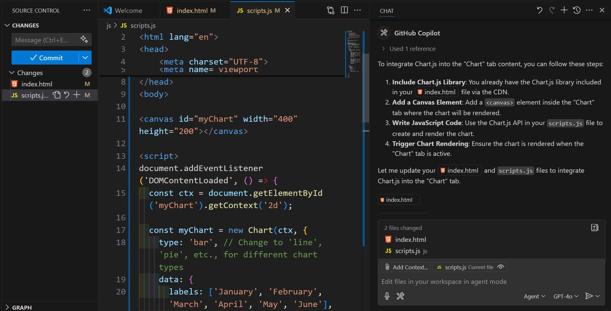
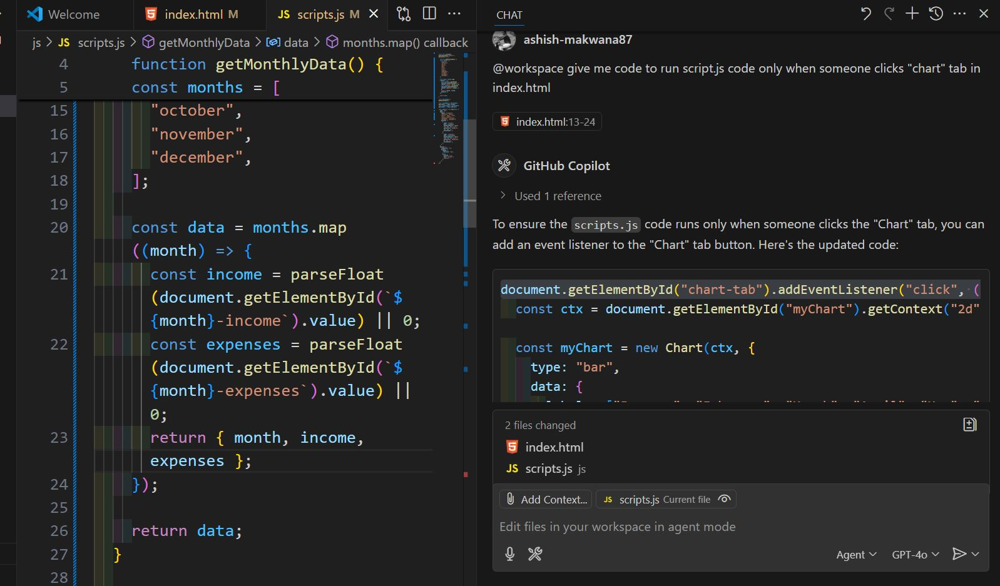
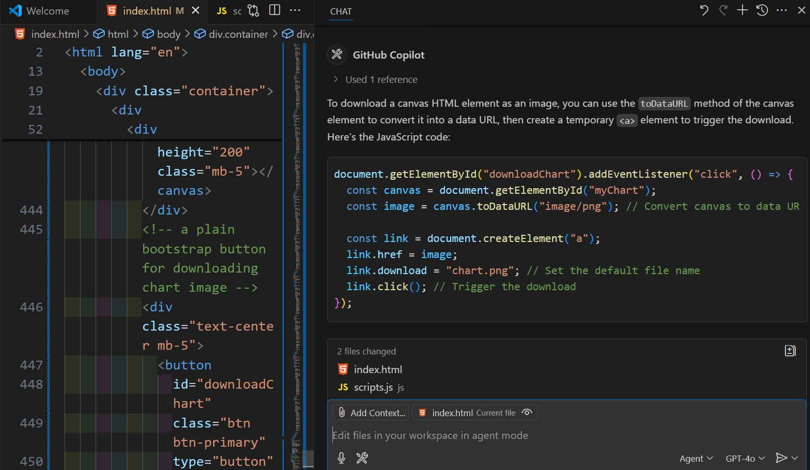

## Data To Chart Project using GitHub Copilot
A simple HTML project created using GitHub Copilot. 

**Project URL:**
https://github-copilot-data-to-chart.netlify.app

**Key Features:**
- GPT-4o Copilot model used to generate code.
- Code generation with GitHub Copilot Edits and @workspace settings.
- Display of charts based on income and expense inputs.

**Tabs generation**

**chart.js integration**

**Updating script.js to generate charts**

**Adding chart download button**

